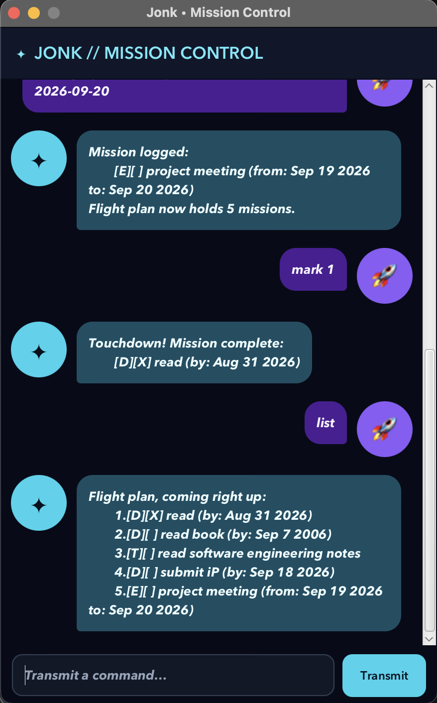

# Jonk User Guide

Jonk is your mission-control copilot for everyday tasks. Track todos, deadlines, and events by typing short
commands. Jonk calls your tasks **missions** and your task list the **flight plan**.



[Quick start](#quick-start) · [Commands](#commands) · [Saving your tasks](#saving-your-tasks) ·
[Troubleshooting](#troubleshooting)

## Quick start

1. Install **Java 25**. Run `java -version` in a terminal to check your version.
2. Download `jonk.jar` from the [latest release](https://github.com/jonkohzy/ip/releases/latest).
3. Put it in a folder where you want to keep your tasks. Open a terminal in that folder and run:

   ```sh
   java -jar jonk.jar
   ```

4. In the Jonk window, type a command in the transmission field. Press **Enter** or click **Transmit**.
5. Try `todo read book`, then `list`. Use the number shown by `list` with `mark NUMBER` when you finish.

Scroll through the conversation to revisit earlier replies. Type `help` whenever you need a command reminder.

## Commands

- Use lowercase command words. Replace uppercase placeholders such as `DESCRIPTION` with your own text.
- Descriptions and search keywords can contain spaces and must not be empty. Do not add quotation marks.
- Dates use `yyyy-MM-dd`, such as `2026-09-18`. Times are not supported.
- Keep `/by`, `/from`, and `/to` in the order shown, with a space before and after each marker.
- Use numbers from the latest **`list`** response for `mark`, `unmark`, and `delete`.
- Enter `help`, `list`, and `bye` without arguments. Type `list` and `bye` without surrounding spaces.

### Show help: `help`

Displays the command reference and examples inside the conversation. Your tasks are unchanged.

**Command:** `help`

### Add a todo: `todo`

Creates a task without a date.

**Format:** `todo DESCRIPTION`

**Example:** `todo read book`

Jonk replies with `Mission logged:` and the task, shown as `[T][ ] read book`.

### Add a deadline: `deadline`

Creates a task with a due date.

**Format:** `deadline DESCRIPTION /by DATE`

**Example:** `deadline submit iP /by 2026-09-18`

The task appears as `[D][ ] submit iP (by: Sep 18 2026)` when using an English system locale.

### Add an event: `event`

Creates a task with start and end dates.

**Format:** `event DESCRIPTION /from DATE /to DATE`

**Example:** `event project meeting /from 2026-09-19 /to 2026-09-20`

Check the dates before submitting: the current version accepts an end date earlier than the start date.

### View all tasks: `list`

Shows all tasks, including completed ones, in the order they were added.

**Command:** `list`

For example, after adding the three tasks above to an empty flight plan:

```text
Flight plan, coming right up:
    1.[T][ ] read book
    2.[D][ ] submit iP (by: Sep 18 2026)
    3.[E][ ] project meeting (from: Sep 19 2026 to: Sep 20 2026)
```

`[T]`, `[D]`, and `[E]` identify todos, deadlines, and events. `[ ]` means incomplete; `[X]` means complete.
An empty list shows just the heading.

### Mark a task complete: `mark`

**Format:** `mark NUMBER`

**Example:** `mark 1`

Marks task 1 from `list` as complete. Jonk replies with `Touchdown! Mission complete:` and shows `[X]`.
The task stays on your flight plan.

### Mark a task incomplete: `unmark`

**Format:** `unmark NUMBER`

**Example:** `unmark 1`

Changes task 1 back to incomplete. Jonk replies with `Course corrected. Mission active again:` and shows `[ ]`.

### Find tasks: `find`

**Format:** `find KEYWORD`

**Example:** `find book`

Searches descriptions for the exact text you enter. Matching is **case-sensitive**: `book` matches `read book`
and `buy notebook`, but not `read Book`. Multiple words are searched as one phrase; dates are not searched.
No matches produces just the `Scanner results—matching missions:` heading.

**Search results are numbered separately.** Run `list` again before marking or deleting a task, because a number
shown by `find` may refer to a different task in the full list.

### Delete a task: `delete`

**Format:** `delete NUMBER`

**Example:** `delete 2`

Removes task 2 from the full list immediately. There is no undo command. Remaining tasks are renumbered, so run
`list` again before your next numbered command. To correct a task's description or dates, delete it and add it again.

### Exit: `bye`

**Command:** `bye`

Displays Jonk's farewell and closes the window. Your successfully saved tasks will be available next time.

## Saving your tasks

Jonk saves automatically after adding, deleting, marking, or unmarking a task. There is no save command.
It uses `data/jonk.txt` inside the folder **from which you launch the app**. Launch from the same folder each time
to load the same flight plan.

On first use, a missing data file is normal: Jonk starts empty and creates the folder and file when you add a task.
To back up or transfer tasks, close Jonk and copy the `data` folder together with your JAR file.

## Troubleshooting

| What you see | What to do |
| --- | --- |
| `Signal unclear.` | Check the command spelling and lowercase letters, or type `help`. Remove extra text after `list` or `bye`. |
| A missing-description or missing-date message | Supply a description and all required date markers and values. |
| `Navigation dates must use yyyy-MM-dd format.` | Use a real calendar date, such as `2026-09-18`; `2026-02-30` is invalid. |
| A task-number error | Run `list`, then use one whole number from that list, starting at 1. |
| `Could not save tasks` | Check that your launch folder is writable and `data/jonk.txt` is a file, not a folder. The attempted change was rolled back; retry after fixing the problem. |
| `Could not load tasks` | Close Jonk and back up `data/jonk.txt` before repairing it or restoring a known-good copy. Jonk starts empty after this error; adding a task can overwrite the original file. |
| Your tasks seem to have disappeared | Check that you launched Jonk from the same folder as before and that its `data/jonk.txt` is still there. |

**Current description limitation:** avoid a space followed by `/` in descriptions. For example,
`todo revise / review notes` currently saves only `revise`; use `todo revise and review notes` instead.

The guide's organization follows the [SE-EDU sample User Guide](https://se-education.org/addressbook-level3/UserGuide.html).
